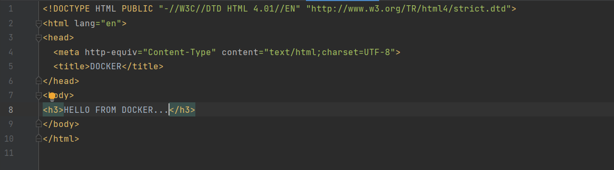
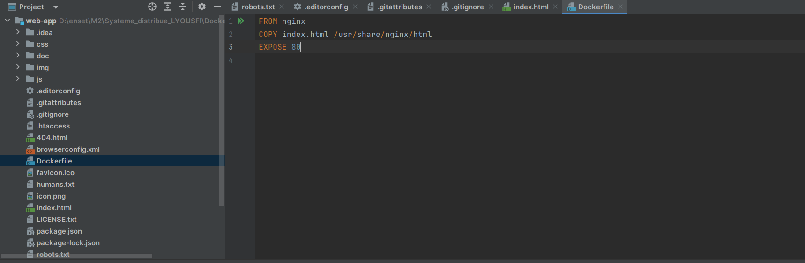
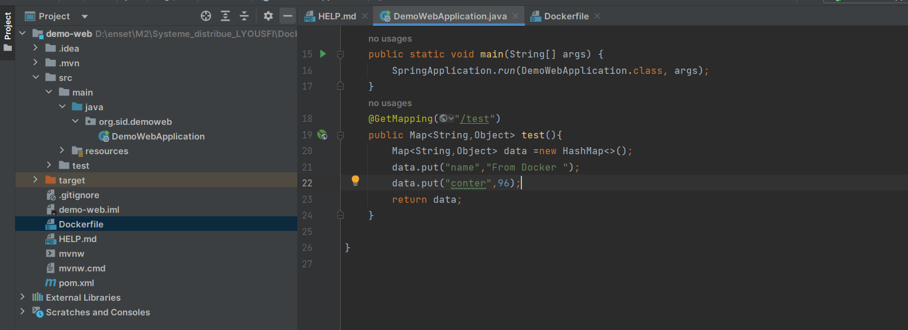
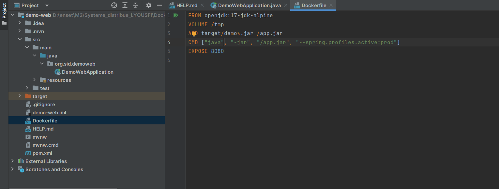
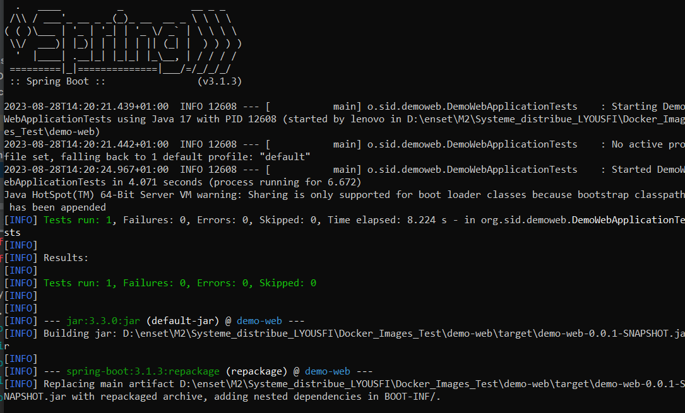
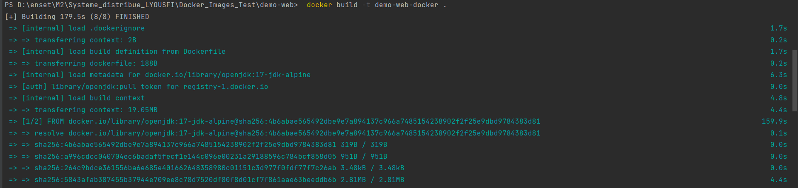
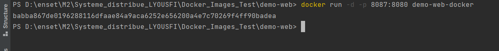

<H1  style="text-align:center"> Dockerizing Spring Application: Seamless Transition from HTML Testing  </H1>
<H2>- TEST OF HTML APPLICATION </H2>
<H3>- Code html </H3>

<H3>- Dockerfile </H3>

<H3>- Build docker image </H3>

<H3>- Run the container</H3>

<H3>- Test of html application</H3>

<H2>- TEST OF SPRING APPLICATION </H2>
<H3>- Code</H3>

<H3>- Dockerfile </H3>

<H3>- mvn package</H3>

<H3>- Build docker image </H3>

<H3>- Run the container</H3>

<H3>- Test of spring application</H3>

